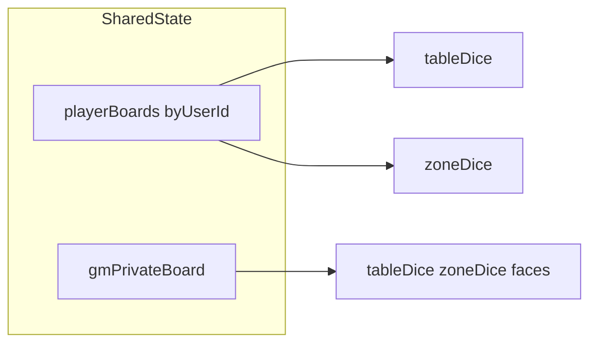

# Virtual Dice Table — AI / implementer specification

This document instructs how to build a **Foundry VTT module** that provides a **shared, synchronized “virtual table” window** where players roll and manipulate dice visually. It is specification-only: implement the module according to these rules.

**Naming:** This file is `AI.md` so any coding assistant can use it. If you prefer Cursor/Claude-specific naming, duplicate or symlink as `CLAUDE.md`.

---

## 1. Product intent

### Goals

- A **separate window** inside Foundry (not a replacement for core chat rolls).
- **Visual-first**: users specify **how many dice** to roll (and optionally die type, e.g. d6); the UI shows **each individual die** and its face/value after rolling.
- **Shared experience**: when any client performs an action that changes dice, **all connected clients** see the update after sync.
- **One board per player**: each logged-in (or active) user has **their own isolated board state**—their dice on the table, their zone, their die-type setting—keyed by user id in shared state.
- **Jump between boards**: **every** player may **switch which board they are viewing** (tabs, chips, or a dropdown) to watch another player’s board. Viewing is read-only for boards they do not own (except GM override rules below).
- **Default view on open**: when the window opens, **default the viewport to the current user’s own board** (`game.user.id`), not someone else’s.
- **GM private board**: the GM has an **additional board that is private to GMs**—only users with `game.user.isGM` see it in the board picker and only GMs may mutate it. Players must not see GM dice state or even the GM-board tab (hide entirely for non-GMs).
- **Interactions**:
  - **Marquee / drag-rectangle** selection over dice on the table.
  - **Drop zone**: dice can be moved from the main table into a separate zone that **tracks** which dice were dropped there.
  - **Reroll everything** button.
  - **Double-click** a single die → reroll **only that die** (same logical die id, new random value).
  - After selecting multiple dice → action to **reroll selected only**.
- **Reset board**: a **Reset board** button clears the **currently viewed** board (empty `tableDice` and `zoneDice`, optionally reset `faces` to a default). Only the **board owner** or a **GM** may trigger reset for that board (GM may reset any player board or the GM private board).
- **Entry point**: an obvious control (e.g. scene controls toolbar button) to **open** this window.

### Explicit non-goals

- **Not** the canonical mechanical dice roller for the system: no requirement to use Foundry’s `Roll` class, post roll messages to chat, or integrate modifiers/system hooks for “the” official roll outcome.
- **Not** focused on totals, DC comparison, or audit trails unless you add them later deliberately.
- Do **not** hook `CONFIG.Dice.termTypes` or core dice pipelines unless you intentionally add a second integration phase.

---

## 2. Reference modules (local examples)

Use these **only as patterns** for Foundry APIs and structure—do not copy unrelated game logic.

| Concern | Example path | What to mirror |
|--------|----------------|----------------|
| `ApplicationV2` + Handlebars + scene button | `simple-dice-roller-deluxe/scripts/sdrd-dice-table.js`, `simple-dice-roller-deluxe/scripts/sdrd-hooks.js`, `simple-dice-roller-deluxe/scripts/sdrd-constants.js` | Window class, `DEFAULT_OPTIONS` / `PARTS`, `getSceneControlButtons` + `renderSceneControls` to open the app |
| Module sockets + synced UI state | `farkledice/module.json` (`"socket": true`), `farkledice/modules/init.js` | `game.socket.emit` / `game.socket.on(\`module.<id>\`, …)` |

Absolute workspace roots (adjust if the module lives elsewhere):

- `c:\Users\andre\AppData\Local\FoundryVTT\Data\modules\simple-dice-roller-deluxe\`
- `c:\Users\andre\AppData\Local\FoundryVTT\Data\modules\farkledice\`

---

## 3. Official Foundry documentation

Embed these when onboarding developers:

- **Module development:** https://foundryvtt.com/article/module-development/
- **API index (search for ApplicationV2, HandlebarsApplicationMixin, ClientSettings):** https://foundryvtt.com/api/
- **Sockets:** enable interactivity with `"socket": true` in `module.json` and use `game.socket.emit` / `game.socket.on` as documented for package developers (see module development article and API references to `game.socket`).

Target **Foundry V13+** for `ApplicationV2` and current hook patterns; set `compatibility.minimum` / `verified` in `module.json` to match what you test against.

---

## 4. Module scaffolding

### `module.json`

- `id`, `title`, `description`, `version`, `authors`
- `compatibility`: align with V13+ (match your test Foundry version)
- `esmodules`: ordered entry file(s); split constants / app / hooks if useful
- `styles`: CSS for the window and dice layout
- **`"socket": true`** — required for cross-client synchronization (same idea as `farkledice`)

### Hooks (typical split)

- **`init`**: register optional `game.settings`, register Handlebars helpers, `foundry.applications.handlebars.loadTemplates([...])` for your `.hbs` paths.
- **`ready`**: register `game.socket.on(\`module.<your-module-id>\`, handler)`; expose `game.modules.get(id).api` if you want macros or other modules to open the window.
- **Open button**: `Hooks.on("getSceneControlButtons", …)` plus `Hooks.on("renderSceneControls", …)` to intercept click and `render(true)` your application singleton—same overall approach as `simple-dice-roller-deluxe/scripts/sdrd-hooks.js`.

---

## 5. UI architecture

### Window implementation

- Subclass **`foundry.applications.api.ApplicationV2`** with **`foundry.applications.api.HandlebarsApplicationMixin`**.
- Define **`static PARTS`** pointing at Handlebars templates for layout regions (toolbar, player strip, table surface, drop zone, controls).
- Implement **`_prepareContext`** to pass serializable view-model data (dice lists, selected player id, permissions flags).
- Bind interactions in lifecycle hooks appropriate for ApplicationV2 (e.g. after render) using **`activateListeners`** or the V2 equivalent your Foundry version documents—keep listeners idempotent across re-renders.

### Boards vs viewport

- **Board**: the synced dice state for one logical surface (one player’s board **or** the GM-only private board).
- **Viewport / board picker**: **client-local** `viewBoardId`—which board this client is currently **looking at**. **Do not sync** viewport globally; each user explores boards independently while **dice state** stays synced for everyone who switches to that board.

### Opening the window

- On **`render(true)` first open** (and optionally whenever the app is created), set **`viewBoardId = game.user.id`** so players land on **their own** board.
- **GM default**: when `game.user.isGM`, you may default `viewBoardId` to either **their player board** (same as everyone else) or **the GM private board**—pick one product rule and document it (recommended: default GM to **GM private board** so scratch space is immediate; still allow switching to any player board).

### Toolbar / chrome

- **Roll** (from current count + die type): affects the board belonging to **`targetUserId`** — normally the board owner behind the controls (see permissions).
- **Reroll everything**: same scope rules as today—typically **table** dice only unless you specify otherwise.
- **Board picker**: list every **player board** for users who should appear (active / logged-in—same filter you use elsewhere). Append **“GM (private)”** entry **only** when `game.user.isGM`.
- **Reset board**: clears **whichever board matches `viewBoardId`** (after confirmation dialog optional). Validates owner or GM before emitting.

### Permissions (mandatory rule)

- **Mutations** (roll, reroll, move to zone, **reset board**) apply to a **`targetBoardId`**: either a **`game.users` id** for a player board **or** a reserved constant (e.g. `GM_PRIVATE_BOARD_ID`) for the GM private board.
- **Player boards**: **only** `game.user.id === targetBoardId` may mutate that board, **unless** the actor is **GM** (GM may moderate any player board).
- **GM private board**: **only** `game.user.isGM` may view **or** mutate; reject all socket payloads from non-GMs that reference this board.
- Enforce rules **both** in the UI (disable/hide controls) **and** in the socket merge path (ignore unauthorized acts).

**Spectator rule:** Any user may **view** another player’s board, but **mutation controls** target the board matching **`viewBoardId`** only when the viewer **owns** that board or **is GM**; otherwise show controls disabled or switch prompts (“Switch to your board to roll”).

---

## 6. Interaction requirements

Implement inside the **HTML layer of the Application** (not on the canvas) unless you have a strong reason—avoids conflict with Foundry’s scene interactions.

| Interaction | Behavior |
|-------------|----------|
| Marquee selection | Pointer down on empty table → drag rectangle → on pointer up, mark all dice whose bounds intersect the rectangle as **selected**. |
| Drop zone | Dice dragged (or selected + “move to zone” action) leave `tableDice` and append to `zoneDice`. Persist order or slots consistently. |
| Double-click die | Reroll **that die id only** (new value in range `1..faces`). |
| Reroll selected | If selection non-empty, reroll only those ids; clear selection after reroll (optional UX). |
| Reroll everything | All dice on **table** get new values (define zone behavior explicitly). |

Use **pointer events** (`pointerdown` / `pointermove` / `pointerup`) for marquee and hit-testing. For dragging individual dice between regions, **HTML5 drag-and-drop** or pointer-driven drag offsets are both acceptable; pick one and keep coordinates in **table-local** space for marquee math.

---

## 7. Sync architecture

### Recommended model: GM-authoritative merges

1. Clients emit **intent** messages: `{ type, payload, targetBoardId }` with actor `game.user.id` (`targetBoardId` is a player user id or GM-private constant).
2. **GM client** (or a designated host-only path if you use `socket.emit` broadcast patterns carefully) validates permission, applies mutation to in-memory **shared state**, broadcasts **`syncFullState`** or a **patch** to all clients.
3. All clients update local copy and **`render(true)`** the app.

**Alternative:** optimistic UI with **sequence numbers** per player table; discard stale updates. Document race cases (two tabs reroll same die).

### Socket channel shape

- Channel: ``game.socket.emit(`module.<module-id>`, { type, payload })``
- Subscribe in `ready`: ``game.socket.on(`module.<module-id>`, handler)``

### Suggested `type` enum (extend as needed)

| type | Purpose |
|------|---------|
| `syncFullState` | Replace entire shared state (initial join, GM repair). |
| `rollNew` | Replace table dice with `count` new dice on `targetBoardId`. |
| `rerollAll` | Reroll all table dice on `targetBoardId`. |
| `rerollDieIds` | Reroll subset `{ ids: string[] }` on `targetBoardId`. |
| `moveDice` | On `targetBoardId`, move `{ ids: string[], to: "table" \| "zone" }`. |
| `resetBoard` | Clear `tableDice` / `zoneDice` (and optional `faces`) for `targetBoardId`. |

Always include enough context to validate: `targetBoardId` (or `targetUserId` if you only use user ids for players—use an explicit id for GM private board), `actorUserId`, optional `timestamp` / `seq`.

---

## 8. State shape (normative)

Single serializable object maintained identically on every client after each applied message.

**Board payload** (repeated per player and for GM private):

```text
BoardState: {
  faces: number,
  tableDice: Die[],
  zoneDice: Die[]
}
```

**Top-level shared state:**

```text
sharedState: {
  version: number,
  playerBoards: {
    [userId: string]: BoardState    // one board per player user id
  },
  gmPrivateBoard: BoardState       // GM-only; omit from UI on non-GM clients
}

Die: {
  id: string,
  value: number,                   // 1..faces
}
```

- Implementers may flatten `playerBoards` + `gmPrivateBoard` into one map using a **reserved key** for the GM board instead of a separate field—either way, **permission rules** above stay the same.
- **`selected` state**: keep selection **client-local** per viewport.
- **`faces`**: document behavior when die type changes (clear vs convert).



**Client-only UI state** (not sent over socket): `viewBoardId` (`game.user.id` or `GM_PRIVATE_BOARD_ID`), local selection rectangles.

---

## 9. Randomness

- Prefer **`crypto.getRandomValues`** or Foundry’s documented RNG utilities if you need consistency with Foundry conventions.
- Avoid **`Math.random` alone** if fairness or reproducibility matters for your group.

---

## 10. Visual rendering (tiered options)

Pick one path and stick to it:

1. **CSS / DOM**: grid or flex of die faces (numbers or pips), optional CSS transition for “roll” flair—smallest dependency.
2. **3D library** (e.g. Dice Box style packages): richer visuals, larger bundle and integration cost.
3. **Sprites**: image per face; good for themed dice.

The spec requires **clear per-die identity** in the DOM (data attributes matching `Die.id`) so marquee selection and drag targets work reliably.

---

## 11. Testing checklist

- Two browsers / two logged-in users: **each opens the window** and lands on **their own** board; each **switches** to the other’s board and sees matching synced dice; rolls on owner client appear when viewer switches.
- **Non-owner** viewing another board cannot mutate it (controls disabled); payloads forging another `targetBoardId` are **rejected** unless GM.
- **GM private**: logged-in **player** never sees GM board in picker; **GM** sees it, rolls there, and players remain unaware.
- **GM** can mutate any **player** board if you implement override; **Reset board** works for owner on own board and GM on any allowed board.
- **Reset** clears viewed board only when authorized; all clients see empty table/zone after sync.
- Marquee selects multiple dice; **reroll selected** updates only those ids on all clients.
- **Drop zone** moves dice; counts match after sync.
- **Double-click** single die rerolls only that die.
- **Stress**: max dice count (enforce a sane cap in settings), resize window, repeated open/close without listener leaks.

---

## 12. File layout suggestion (for implementers)

```text
virtual-dice-table/
  module.json
  scripts/
    constants.js      # MODULE_ID, SOCKET_EVENT, maybe MAX_DICE
    state.js          # reducers / pure functions for mutations (optional)
    virtual-table-app.js  # ApplicationV2 class
    main.js           # hooks + socket wiring + singleton app
  templates/
    virtual-table.hbs
  styles/
    virtual-table.css
  lang/
    en.json
```

This layout is advisory; keep parity with how your other modules organize ES modules and templates.

---

## Summary

Build a **socket-synced ApplicationV2** window where **each player has their own board**, **everyone can jump between boards** via a **client-local viewport**, the window **opens on your own board** (GM: optionally default to **GM private board**), and **GMs have a private board** invisible to players. Include **Reset board** for clearing the authorized target board. Add **marquee selection**, **zone drops**, and **targeted rerolls**, deliberately **outside** core Foundry roll mechanics. Use **`simple-dice-roller-deluxe`** as an Application + toolbar pattern and **`farkledice`** as a **socket + shared state** pattern; validate permissions on every mutation.
